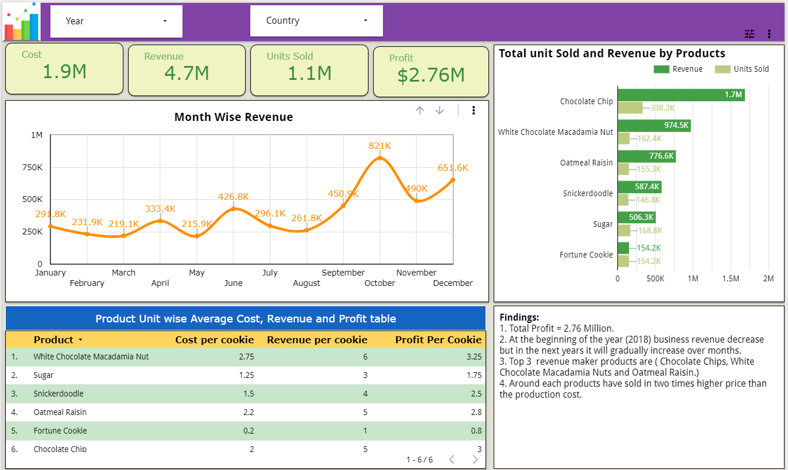

# Looker Studio Business Dashboard

## Project Overview
This project is an interactive dashboard created using Google Looker Studio, formerly Google Data Studio. The dashboard is designed to visualize key business metrics, identify trends, and support data-driven decision-making.

## Objectives
- Build a clean and interactive BI dashboard
- Track important KPIs and business performance
- Present data insights in a simple visual format
- Improve reporting accessibility for stakeholders

## Tools Used
- Google Looker Studio
- Google Sheets / CSV Data Source
- Data Visualization
- Dashboard Design
- KPI Reporting

## Key Features
- Interactive dashboard layout
- KPI summary cards
- Trend visualizations
- Business performance insights
- Easy-to-understand reporting view

## Dashboard Preview
The dashboard includes visual summaries that help users quickly understand performance trends and key metrics.

## Skills Demonstrated
- Business Intelligence
- Data Visualization
- Dashboard Development
- KPI Reporting
- Analytical Storytelling
- Stakeholder Reporting

## Project Outcome
This dashboard demonstrates the ability to transform raw data into a professional reporting dashboard that supports business analysis and decision-making.
